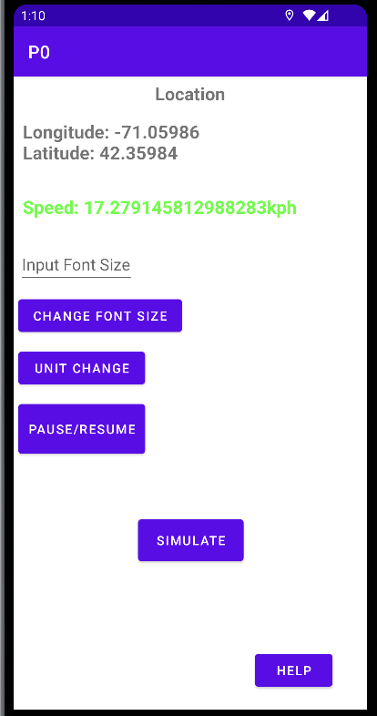
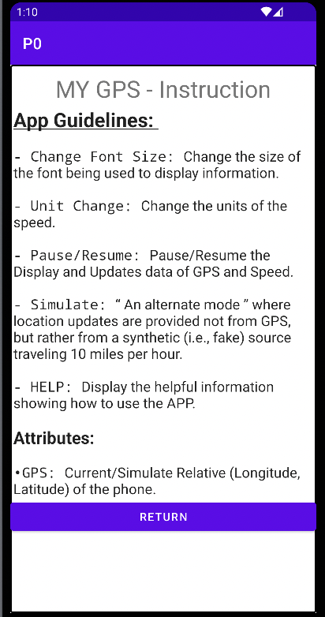

# EC501_HW2 Problem_0: 

## Introduction:

Note: This project was bootstrapped with the Platform of Android mained in Java Language, which could be found in details of [Android API 13](https://developer.android.com/about). API and Reference: Android 13, the latest version of Android, includes stronger protections for user privacy, improvements for developer productivity.

- **Group Member:** `Xingyu Chen, Zhaozhong Qi, Yuxiang Wan, Shuyan Zhang`

In this project, our team designed and depolyed an a simple Android application who satisfies the following specifications:

- It has accesses the phone's GPS unit to get regular updates of location information.
- It calculates and displays the speed at which the phone is moving (in miles per hour), based on the GPS data.

About more information about the Current Androud system or Platform, please find out the page in Helpful Sections: 

### Functionalities: 

-   `Change Font Size`: Allow the user to change the size of the font being used to display the speed.

-   `Pause/Resume`: A pause button that allows the user to Pause/Resume the Display and Updates data of GPS and Speed.

-   `Unit Change`: Allow the user to change the units in which the speed is being displayed.

-   `Simulate`: The button allowed user to switchover to the alternative mode: **TEST**, where the location updates are provided not from GPS but rather from a synthetic (simulated) source traveling 10 miles per hour.

-   `HELP`: The button will help you jump to the display of helpful information on how to use the app.

#### Except those basic integrated Button, The APP also possess the following attributes while playing the GPS and Speed Data: 

### Basic Attributes: 

1. **GPS:** Current / Simulate Relative Location data in **(Longitude, Latitude)**. 
2. **Speed:** Current / Simulate Speed of the phone.
3. **Two alternative mode:** Simulate / Real-time. Simulate Mode introduced like above, The Real-time mode are just display the currnet Real-time Location and Speed data.
4. **Color change:** The color of the speed display will be various based on the travel speed being detected by the Phone.

### The Following pictures are the Interface Preview of the APP: 

 

### Before you running with the code and build the project, there are several steps needed of environment Set-up. Check the following section `#Environment SetUp` to learn about what needed to be installed.

## Environment SetUp: 

We Recommend you install the Android Studio and it just takes just a few clicks, menwhile it will help you build up all the necessary compoments enable to running this APP. For more details, check the link: [Install Android Studio](https://developer.android.com/studio/install)

Good Tutorial and examples about Setting-up, Import and build the project: 

1. [Build your first Android APP in Java](https://developer.android.com/codelabs/build-your-first-android-app?hl=zh-cn#0)
2. [Android Application Fundamentals](https://developer.android.com/guide/components/fundamentals)

